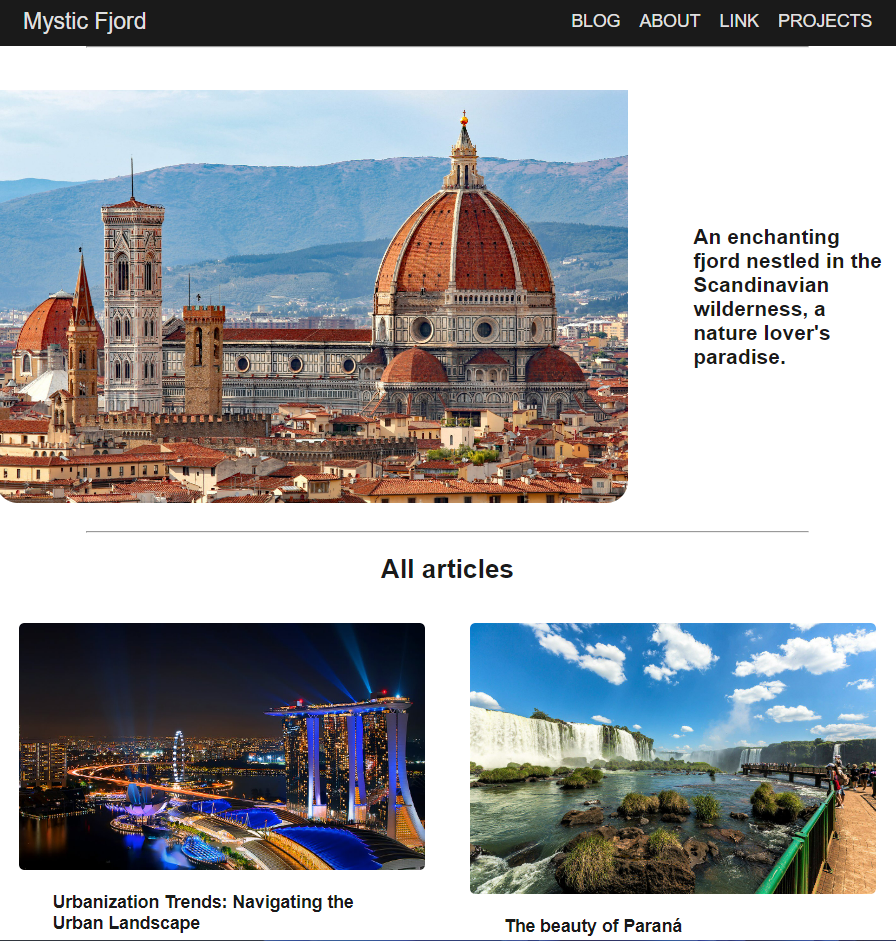

# Mystic Fjord

A Beginner's Dynamic Blog Project Using TypeScript

## indice
<ul>
<li> Tecnologies  </li>
<li> Directories </li>
</ul>

## Tecnologies 
<ul>
<li> TypeScript</li>
<li> Html5</li>
<li> CSS3</li>
<li> JavaScript</li>
</ul>

## Directories
<ul>
    <li> assets -->Visual Resources
        <ul>
            <li> img --> Images
                <ul>
                    <li> post --> Images for Post Content</li>
                </ul>
           </li>
        </ul>   
    </li>
<li> src --> TypeScript Files</li>
 
</ul>

